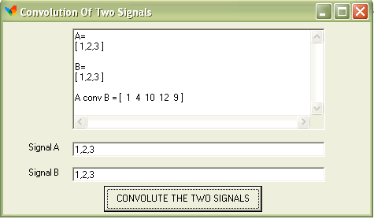



## Convolution Of Two Signals

### Description

Convolution of Two input signals by sherif rofael , First Time in planet source code , advanced code ,
 
### More Info
 

             |
---                |---
**Submitted On**   |2003-01-28 13:20:56
**By**             |[sherif  rofael](https://github.com/Planet-Source-Code/PSCIndex/blob/master/ByAuthor/sherif-rofael.md)
**Level**          |Intermediate
**User Rating**    |5.0 (15 globes from 3 users)
**Compatibility**  |VB 5\.0, VB 6\.0
**Category**       |[Math/ Dates](https://github.com/Planet-Source-Code/PSCIndex/blob/master/ByCategory/math-dates__1-37.md)
**World**          |[Visual Basic](https://github.com/Planet-Source-Code/PSCIndex/blob/master/ByWorld/visual-basic.md)
**Archive File**   |[Convolutio1536451292003\.zip](https://github.com/Planet-Source-Code/sherif-rofael-convolution-of-two-signals__1-42795/archive/master.zip)

